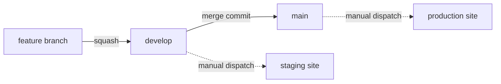
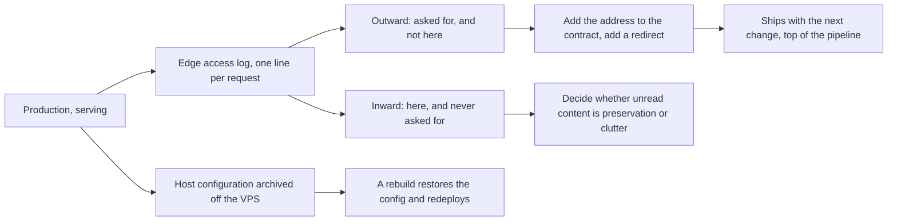

# Blog <!-- omit from toc -->

Pieter Viljoen's blog, and the tooling that builds, verifies, and deploys it.

The live blog is hosted at [blog.insanegenius.com][blog-link].

## Build and Distribution <!-- omit from toc -->

- **Source Code**: [GitHub][github-link], holding the source, issues, discussions, and CI/CD pipelines.
- **Versioned Releases**: [GitHub Releases][releases-link], version-tagged source archives.

### Build Status <!-- omit from toc -->

[![Release Status][release-status-shield]][actions-link]\
[![Last Commit][last-commit-shield]][commits-link]

### Releases <!-- omit from toc -->

[![GitHub Release][release-version-shield]][releases-link]\
[![GitHub Pre-Release][pre-release-version-shield]][releases-link]

### Release Notes <!-- omit from toc -->

**Version**: 1.0

**Summary**:

- First public release. The content, media, URL contract, and deploy tooling are published as a repository for the first time.
- The URL contract is committed ground truth and gated in CI: 328 addresses that must render, 917 that must redirect, and 778 legacy image URLs that must resolve.
- The site is not yet serving its public address. This release is the source and its pipeline, not the cutover.

See [Release History][history] for complete release notes and older versions.

## Table of Contents <!-- omit from toc -->

- [Use Cases](#use-cases)
- [Migration from WordPress](#migration-from-wordpress)
- [How a Change Reaches the Site](#how-a-change-reaches-the-site)
- [Configuration](#configuration)
- [Questions or Issues](#questions-or-issues)
- [Development Environment Setup](#development-environment-setup)

## Use Cases

A personal technical blog, published as a static site and served from a host the author owns. It holds the writing itself and everything needed to put it online, so the site is reproducible from this repository alone.

Three parts, each with a distinct job:

- **The content**, one file per URL, in a tree that mirrors the addresses it serves.
- **The URL contract**, the full set of addresses the site answers, and the gates that prove it still answers them.
- **The deploy tooling**, which builds a release, verifies it, and swaps it into place atomically.

The site answers far more addresses than it renders pages, because it has served the same domain across earlier platforms whose address shapes are still in search indexes and in other people's links. The extra addresses are redirects the web server satisfies, and they are why the contract is enforced rather than assumed: a missing page is obvious, while a missing redirect is silent and surfaces months later as traffic that stopped arriving. Two gates cover it. One checks the built output before a release is installed, and one checks a running server, because a redirect is the server's job and no build can prove it.

Deployment is a release directory plus a symlink. A build is installed alongside its predecessors, verified, and made live by swapping one link, so a rollback is the same swap in reverse. See [OPERATIONS.md][operations].

## Migration from WordPress

The site has served the same domain since 2008, across three platforms: Blogger until 2012, WordPress until 2026, and Hugo from then on. Converting the posts took an afternoon. Preserving sixteen years of inbound links was the work, and it is why this repository carries a URL contract and gates it rather than trusting the build.

How it was done is in [`capture/README.md`][capture-readme], and the account of it is a post on the site, [Moving This Blog From WordPress to Hugo][migration-post]. It covers what a WordPress export holds and what it leaves out, why the sitemap named barely a tenth of the addresses the site was actually serving, how the Blogger-era permalinks resolve through a lookup table rather than a pattern, why media fetched over HTTP is not the same bytes as the media in the export and only a content hash tells them apart, and which Hugo default moves every taxonomy archive to a new address without reporting anything.

## How a Change Reaches the Site

A change starts on a branch in this repository and ends as bytes on a VPS. Every stage carries a gate, and three of them add a human read, because the failure this repository exists to catch is an address that stops answering, and no check that skips a running server can see one.

Both deploys are manual workflow dispatches, so a merge publishes nothing and each environment goes live by a deliberate run.

[`WORKFLOW.md`][workflow] states the same CI machinery as a contract for tooling, and [`OPERATIONS.md`][operations] holds the procedure to run at a keyboard.

```mermaid
flowchart LR
  subgraph local["1. On a branch"]
    direction TB
    w["New branch, write the post"] --> b["Build, warnings are fatal"]
    b --> p["Gate: every page that must render, renders"]
    p --> m["Release onto the local mirror"]
    m --> l["Gate: every URL in the contract, against a running server"]
    l --> e1["Human: read the page"]
  end

  subgraph gh["2. On GitHub"]
    direction TB
    pr["Pull request into develop"] --> ci["CI: lint, spelling, build, URL parity"]
    ci --> rv["Automated review, then a human squash merge"]
  end

  subgraph stg["3. Staging, behind the auth gate"]
    direction TB
    ds["Dispatch: deploy staging"] --> ls["Gate: every URL in the contract, run by CI"]
    ls --> e2["Human: read staging"]
  end

  subgraph prd["4. Production, public"]
    direction TB
    pm["Pull request: develop into main"] --> dp["Dispatch: deploy production"]
    dp --> lp["Gate: every URL in the contract, run by CI"]
    lp --> e3["Human: read production"]
  end

  e1 --> pr
  rv --> ds
  e2 --> pm
```



**1. Write on a branch, and prove the artifact locally.** A post is a markdown file under `content/posts/`, written on a feature branch with whatever editor the author prefers. The build treats a warning as fatal, so a deprecated theme API fails it rather than accumulating. The build gate then checks the render half of the contract, which is every address that must return a page.

Most of the contract is not pages, though. It is redirects, and a redirect is the web server's job, so no build reaches them. The release installs onto a mirror on the maintainer's own network, which runs the same Caddy container and the same bundle as the server behind the same Traefik front end. The live gate follows every URL in the contract against that mirror and checks each redirect's destination rather than its status code. A human then reads the page, because no gate has an opinion about the writing.

**2. Open a pull request into `develop`.** CI runs lint, spelling, workflow and config validation, the build, and the render gate on a clean checkout. It does not prove the redirects, which is why the local run is a prerequisite rather than a convenience: a change to the Caddy config or to a redirect map goes green in CI while the redirect it broke stays broken. An automated review runs against the branch, and a human squash-merges it.

**3. Deploy to staging.** A dispatched workflow builds the commit, uploads the release, flips the symlink, and runs the same live gate from CI against the running site. The local mirror proves the artifact, and staging proves the infrastructure that exists only on the server: routing, TLS, the deploy key, and its confined transport. Staging keeps its authentication gate on and the check presents a token, so a byte-identical copy of the public site is never exposed to a crawler. A human then reads it.

**4. Promote, and deploy production.** `develop` merges into `main` through a pull request, and production is a second dispatch that accepts `main` alone. The same gate runs a third time, against the public address and with no token, and a human reads the result.

Each branch feeds one environment:



### What Happens While the Site Runs <!-- omit from toc -->

Publishing is half of it. The other half runs on its own cadence, because the contract proves only the addresses someone wrote down.



**Real traffic is the only source that finds what the contract misses.** Every request to the host is recorded at the edge, one line per request, and the review runs in two directions. The outward pass reads non-200 responses. A 404 on a path shaped like real content means an old link nobody recorded, and the fix is to add the address to the contract and add a redirect, which then ships through the pipeline above like any other change. Scanners probing for `wp-login.php` dominate the raw count and are filtered by shape rather than investigated. The inward pass subtracts every address that has ever answered 200 from the set the site builds, which names content no reader has reached. That evidence accumulates slowly, and it is the only thing that settles whether media the old platform never published is worth carrying.

**Backups protect the server rather than the site.** The site is reproducible from this repository by running a deploy, so what is worth keeping is the host's configuration: the container definitions, the proxy configuration, and the deploy account with its restricted key. A bare-metal restore rebuilds the host, restores that configuration, and deploys again. A procedure that backs up the deploy root protects a copy of something git already holds.

[OPERATIONS.md][operations] holds the detail: the commands, the environments, the rollback, and the three log tiers with what each cannot see.

## Configuration

| Path | Holds |
| --- | --- |
| [`hugo.yaml`][hugo-config] | site configuration, taxonomy URLs, and the feed name |
| [`checks/`][checks] | the URL contract and the gates that enforce it |
| [`deploy/`][deploy] | the release script, the web-server config, and the redirect maps |
| [`capture/`][capture] | the migration's provenance tooling, and how the site was derived from the old platform's exports |
| [`ops/`][ops] | the pull that copies the server's backups and access logs off it, and its schedule |
| [`ENVIRONMENT.md`][environment] | every configuration value, described once |

Every configuration value is described in [ENVIRONMENT.md][environment]. The deploy procedure and the server layout are in [OPERATIONS.md][operations].

## Questions or Issues

To discuss a post, use [Discussions][discussions-link]. The site itself carries no comment system, deliberately: comments on the old platform were closed years ago, and a static site has nowhere to put them without adding a third-party service that outlives its usefulness. Discussions gives a reader somewhere to respond without the site taking on a moving part.

For a defect in the site or the tooling, such as a broken link, a missing redirect, or a page that renders wrongly, open an [Issue][issues-link].

## Development Environment Setup

The required tools and their install commands are listed in [deploy/README.md][deploy-readme]. Hugo must be the extended build.

Build the site and verify it against the URL contract:

```sh
hugo --gc --minify --panicOnWarning
checks/check-url-parity.py public
```

Build a release and verify it against a running server:

```sh
deploy/make-release.sh
checks/check-live-urls.sh "$HUGO_BASEURL"
```

The deploy root and the base URL come from an untracked file per environment under `secrets/`, named `<server>.<environment>.env`, copied from [example.env][env-example] and selected with `ENV_FILE`. `secrets/local.production.env` is the one read when `ENV_FILE` is unset. The whole `secrets/` directory is gitignored, so host-specific values stay out of the published history.

## 3rd Party Tools <!-- omit from toc -->

| Tool | Role | License |
| --- | --- | --- |
| [Hugo][hugo-link] | static site generator | Apache-2.0 |
| [PaperMod][papermod-link] | theme, vendored under `themes/` | MIT |
| [Caddy][caddy-link] | web server, serving the built site and the redirects | Apache-2.0 |

## License <!-- omit from toc -->

Licensed under the [MIT License][license]\
![GitHub License][license-shield]

<!-- Shields -->

[pre-release-version-shield]: https://img.shields.io/github/v/release/ptr727/Blog?include_prereleases&label=GitHub%20Pre-Release&logo=github
[release-version-shield]: https://img.shields.io/github/v/release/ptr727/Blog?logo=github&label=GitHub%20Release
[last-commit-shield]: https://img.shields.io/github/last-commit/ptr727/Blog?logo=github&label=Last%20Commit
[license-shield]: https://img.shields.io/github/license/ptr727/Blog?label=License
[release-status-shield]: https://img.shields.io/github/actions/workflow/status/ptr727/Blog/publish-release.yml?event=workflow_dispatch&logo=github&label=Release%20Status

<!-- Workflow -->

[actions-link]: https://github.com/ptr727/Blog/actions

<!-- Repo -->

[github-link]: https://github.com/ptr727/Blog
[checks]: ./checks/
[commits-link]: https://github.com/ptr727/Blog/commits
[deploy]: ./deploy/
[capture]: ./capture/
[capture-readme]: ./capture/README.md
[ops]: ./ops/
[environment]: ./ENVIRONMENT.md
[deploy-readme]: ./deploy/README.md
[discussions-link]: https://github.com/ptr727/Blog/discussions
[issues-link]: https://github.com/ptr727/Blog/issues
[env-example]: ./example.env
[history]: ./HISTORY.md
[hugo-config]: ./hugo.yaml
[license]: ./LICENSE
[migration-post]: ./content/posts/2026/08/01/moving-this-blog-from-wordpress-to-hugo.md
[operations]: ./OPERATIONS.md
[releases-link]: https://github.com/ptr727/Blog/releases
[workflow]: ./WORKFLOW.md

<!-- External -->

[blog-link]: https://blog.insanegenius.com
[caddy-link]: https://caddyserver.com
[hugo-link]: https://gohugo.io
[papermod-link]: https://github.com/adityatelange/hugo-PaperMod
